# GitHub Tutorial

_by Alvin Nieves_

---
## Git vs. GitHub
 Git is a version control software that takes "snapshots" of a programmers code  
 and keeps track of changes and modifications that have been made to the project   
 itself, while Github is a website where a programmer can send code to the cloud;  
 so that the code itself 'lives' elsewhere in addition to 'living' locally.   
 Github is also at the enter of social coding, where a pethora of programmers can use   
 eachothers' code  to brank off and use others code as a starting point to start their  
 own project.  
 
 In order to work Github needs git, where as Git does not need GitHub to work  
 hence why "Git" can be found in the word "GitHub" and why "Github" is  
 not found in "Git."

---
## Initial Setup
When using Git, a programmer uses `git push` to move their code from 
a local directory to a remote repository. In order to do this, a 
programmer has to have a Github account.  

To set up a github account:
* Go to [_Github_](www.github.com)
* Click "Sign Up" and after filling out ones information click "Create Account"  
  
  
After making a Github account and a repository a programmer can 'push'
their code to the cloud and have it saved in more than just a local
directory.  
When making a github account it is important to set it 
up with SSH(Secure Socket Shell) so that one does not 
have to constantly insert their password.  
_To do this_:  
* Go to "_Your profile_"  
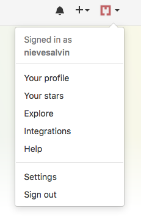  
* Click "_Settings_" and then "_SSH and GPG Keys_"  
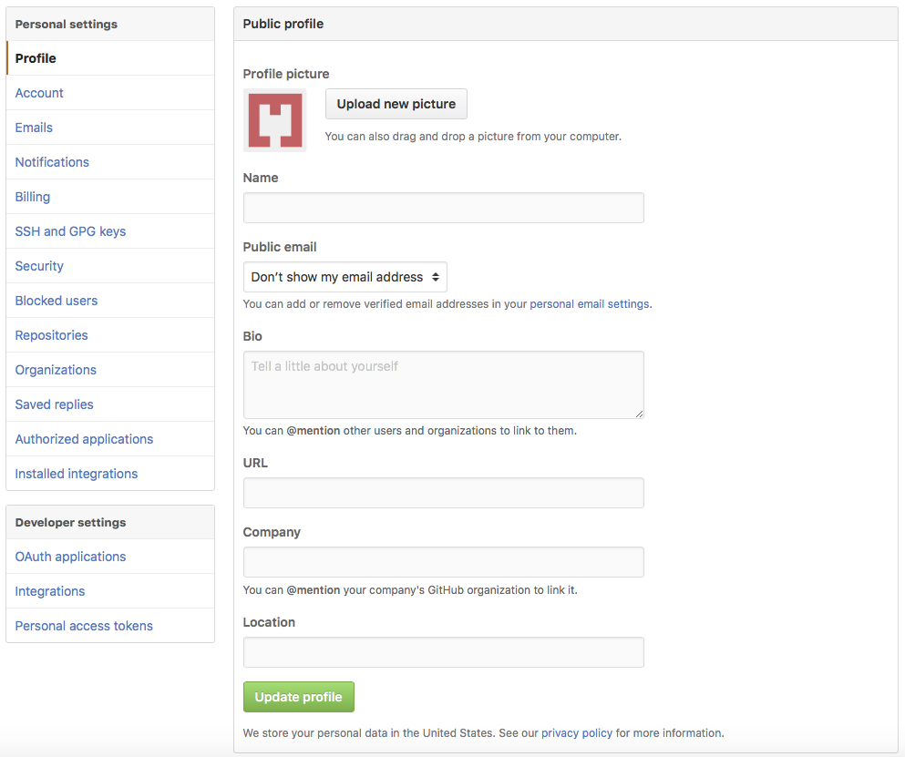  
* Then copy the SSH Code and paste it to your
c9 account at the SSH tab, on the gear icon 
on the top-right of the window.

---
## Repository Setup
As a programmer, in order to be able to push ones code
to a remote repository instead of 
the code living on a single local 
directory. To be able to 'push' code
a 'repo' must be set up on GitHub.  
In order to set up a repository on 

* Go to "_Your profile_"  
  
* Click "_Repositories_"  
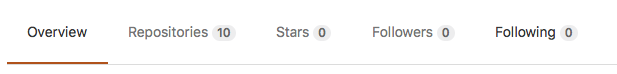  
* Click "_New_"  
  
* Type in the name of the repository 
you want to make and press "_Create_"  
  
* Make sure SSH is selected and Copy and paste the code from
**"or push an existing repository from
the command line."**  
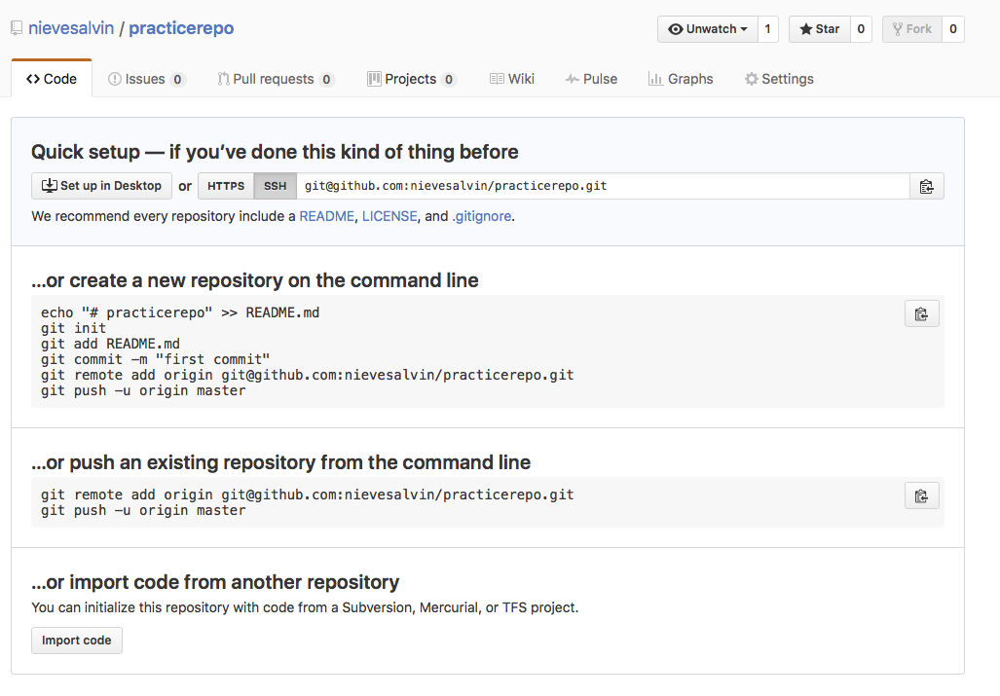  
it should look a like this:  
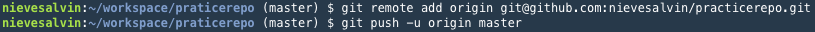  
**Your repo is now set up!**  
When using a repository, a programmer must
remember to git init, in order to create  a 
link between the remote repository and the local
directory. After git has been initalized one 
should constantly `add`,`commit`, and `push` in order
to constantly update your remote repository as well as your
local directory.


---
## Workflow & Commands
When using Git one must know all of the commands and what those 
commands tell the computer to do. Every command does
something different, and there is almost always a way to reverse what one did.  

##### Git Commands:
1._`git init`_: creates a new repository and begins to track changes and modifications in files and folders.   
```bash
nievesalvin:~/workspace/practice $ git init
Initialized empty Git repository in /home/ubuntu/workspace/practice/.git/
```
2._`git status`_: allows programmer to see what files have been modified since the last commit.  
```bash
nievesalvin:~/workspace/github-tutorial (master) $ git status
On branch master
Your branch is up-to-date with 'origin/master'.
Changes to be committed:
  (use "git reset HEAD <file>..." to unstage)

        modified:   README.md
        modified:   directions.md
        new file:   git-log-img.png
```
3._`git commit <filename> -m "message"`_:this is used in order to keep a record of the changes that a programmer has made to a file. When one uses
git commit, it takes a "snapshot" and it sets a digital checkpoint, where 
it shows, when your code last worked.  
```bash
nievesalvin:~/workspace/github-tutorial (master) $ git commit -m "add image to git log"
[master 8329a3c] add image to git log
 3 files changed, 21 insertions(+), 6 deletions(-)
 create mode 100644 git-log-img.png
```  
4._`git add`_: adds files to the "stage" so that the programmer can use `git commit` in order to record changes. One 
can not commit before adding the files to the "stage."
One can add in two different ways. The first 
involves using a '.' which simply means to add all files 
to the 'stage,' and the other way to include the file name
after `git add`.
```bash
nievesalvin:~/workspace/github-tutorial (master) $ git add .
``` 
_Or_
```bash
nievesalvin:~/workspace/github-tutorial (master) $ git add -filename-
```
5._`git push`_: is used to send commits from the local directory to a remote 
repository that lives on the cloud.  
```bash
nievesalvin:~/workspace/github-tutorial (master) $ git push
Warning: Permanently added 'github.com,192.30.253.112' (RSA) to the list of known hosts.
Counting objects: 5, done.
Delta compression using up to 8 threads.
Compressing objects: 100% (5/5), done.
Writing objects: 100% (5/5), 48.27 KiB | 0 bytes/s, done.
Total 5 (delta 2), reused 0 (delta 0)
remote: Resolving deltas: 100% (2/2), completed with 2 local objects.
To github.com:nievesalvin/github-tutorial.git
   b0663d4..8329a3c  master -> master
```  
6._`git clone`_: is used by programmers to copy files from a remote repository
to a local one.  
```bash
nievesalvin:~/workspace/ $ git clone -repositoryurl-
```
7._`git diff`_: is used so that a programmer can see what specific lines of 
code have been changed in a file.
```bash
nievesalvin:~/workspace/github-tutorial (master) $ git diff
diff --git a/README.md b/README.md
index 7d064c2..2a1d90e 100644
--- a/README.md
+++ b/README.md
@@ -59,5 +59,5 @@ to a local one.
 `git diff`: is used so that a programmer can see what specific lines of 
 code have been changed in a file.  
 `git log`: is used to see the number commits, author, message, and time 
-stamp. In order to get out of git log one must simply press 'q'
+stamp. In order to get out of git log one must simply press 'q'  
 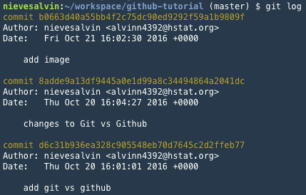
\ No newline at end of file
```  
8._`git log`_: is used to see the number commits, author, message, and time 
stamp. In order to get out of git log one must simply press 'q'  
```bash
nievesalvin:~/workspace/github-tutorial (master) $ git log
commit b0663d40a55bb4f2c75dc90ed9292f59a1b9809f
Author: nievesalvin <alvinn4392@hstat.org>
Date:   Fri Oct 21 16:02:30 2016 +0000

    add image
```  
9._`git pull`_: is used to pull commands down 
from a repository when you have accepted someone 
elses pull request.
#### Command Line Commands
* _ls_: is short for list, and list all of the files in a directory  
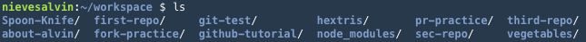
* _cd -directoryname-_: cd is short for change directory and essentially it is used to 
transfer a programmer from one folder to the next.  
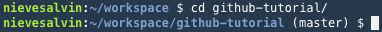  
* _touch -filename-_: touch allows the programmer to create a new file   

* _mkdir -directoryname_: used to make a new directory  
  
* _rm_: can be used by itself, as `rm -rf`, or `rmdir` in order to delete
files or directories with or without force.  
  
  

## Error Handling 
When using git one might forget to change into a
directory before doing `git init`, which would 
leave you with the workspace initalized.  
**Error**: 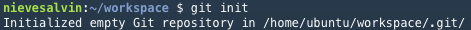  
**Correction**:   
With this error, it is best to use `ls` to see
where the `.git` is, and then use `rm -rf .git`.  
**_Breakdown_**:  
`rm`: stands for remove  
`-rf`: stands for 'repeat' with 'force' hence the 
'rf'  
`.git`: stands for the file that is created when
git init is entered.  

A programmer can also remove a repository in both
a remote or local location. And it does not matter
which you remove first.  

**_Removing a local directory_**:  
* The first way of removing a local directory is 
to do.  
  
* The second way of removing a local directory is 
to do.   
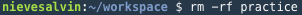  

**In order to remove a remote repository, the 
programmer must go to their [github](www.github.com) account.**  
  
* Click "Your profile"  
  
* Click "repositories"  
  
* Click on the repository you would like to select.  
* Click on "Settings"  
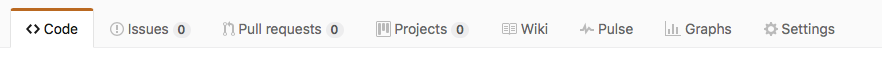  
* Scroll down until you see "Danger zone"
* Click Delete Repository"  
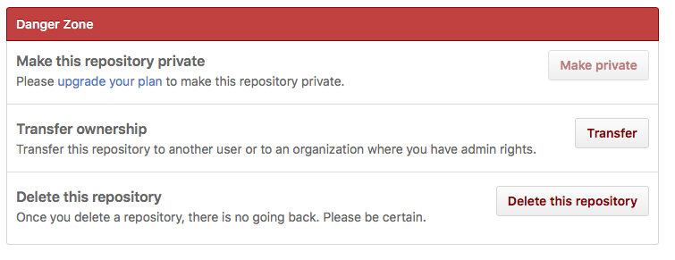  

## Collaboration  
Github is at the core of social coding and it does
by allowing individuals to use others repositories
as their own starting places in order to create 
their own version or their own project. In order 
to do this, a programmer has to 'fork' a persons 
project and then 'clone' it. The concept of 
forking, is to take someones remote repository
and making a copy that can be edited by the 
new programmer. The concept of Cloning is taking
code from the repository that you forked and 
copying it into the local directory so that 
changes can be applied and 'pushed.'  

#### _**Forking**_:  
* Find someone elses repository that you would 
like to use as your starting point, on Github.  
* Once you have found a repo, click on it and 
press "fork"  
  
* After you fork it, Github automatically makes
a repository under your account.   

#### _**Cloning**_:
* Press "Clone or download"  
  
* Once you have done this you should see this:  
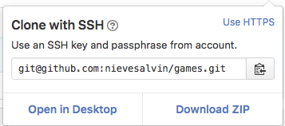  
after press the keyboard and return to c9.  
* Return to the bash terminal and type  
`git clone -url-`  
* It should look like this:  
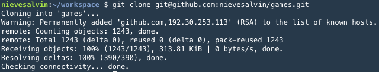  

**Congratulations you have forked and cloned a 
repository!**  

#### _**Pull Request**_:  
Pull request, is basically asking a programmer 
permission to change the code on the repository
in which you copied the code from. Permission can 
either be granted or denied.  
* The way to do this is to go to the repository that
you forked and click on the "Pull request" button:  
  
* After this you will need to wait to have it 
approved or denied.  
* If your request is accepted, the original 
* programmer will then use `git pull` to copy the 
changes that have been made to their remote 
repository. 